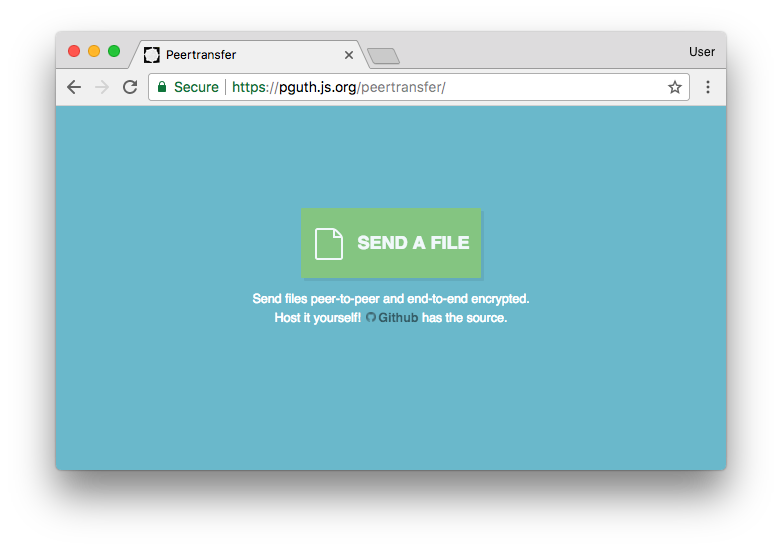

# Peertransfer

[](https://greenkeeper.io/)

In-browser secure peer-to-peer filetransfer in *three simple steps:*

1. Select the file you want to send.
2. Open the generated link on other PCs.
3. Download over a **direct**, **authenticated** and **end-to-end encrypted** line.

*Thus the file will only be available for download as long as the sender keeps his browser tab open.*

[](https://pguth.github.io/peertransfer/)

## Features

- [x] Data is sent directly peer-to-peer.
- [x] Data is transferred using end-to-end encryption (due to WebRTC).
- [x] The messages that are relayed by a server to initiate the p2p WebRTC connections are encrypted (to protect against IP leakages and man-in-the-middle attacks while initiating WebRTC).

# Install

A hosted instance of Peertransfer is available at https://perguth.github.io/peertransfer/

```bash
git clone https://github.com/pguth/peertransfer.git
cd peertransfer
export NODE_ENV=production
npm install
npm start
# You can also set HUB_URLS to a comma separated list of `signalhub` URLs
```

# Related
- **[My presentation slides](https://slides.com/pguth/peertransfer)**
- **A variation of Peertransfer I wrote: [peermesh](https://github.com/pguth/peermesh)**
- [sharedrop](https://github.com/cowbell/sharedrop) "HTML5 clone of Apple's AirDrop - easy P2P file transfer powered by WebRTC"
- [ShareFest](https://github.com/Peer5/ShareFest) "Web based p2p file sharing built on WebRTC Data Channels API"
- [serverless-webrtc](https://github.com/cjb/serverless-webrtc/) "A demo of using WebRTC with no signaling server."
- [WebTorrent](https://github.com/feross/webtorrent) "Streaming torrent client for node & the browser"
- [OnionShare](https://github.com/micahflee/onionshare) "Securely and anonymously share a file of any size"
- [FilePizza](https://github.com/kern/filepizza) "Peer-to-peer file transfers in your browser"
- HTML/CSS of this project are forked from [Creating a File Encryption App with JavaScript](http://tutorialzine.com/2013/11/javascript-file-encrypter/) ([license](https://tutorialzine.com/license): *"You can use, modify and build upon our code for your (or your clients’) personal and commercial projects with no attribution necessary."*).
